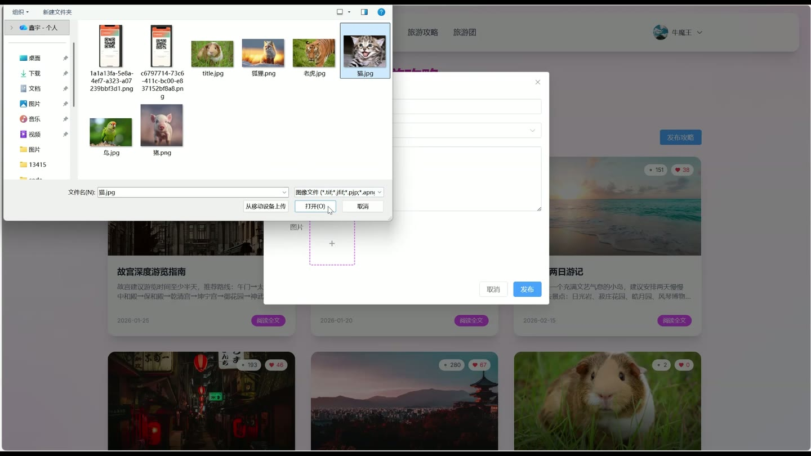
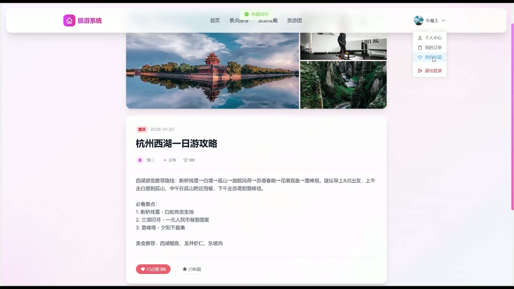
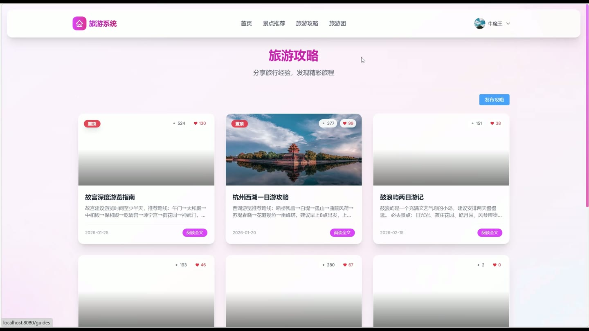

# (附文档)Springboot2+Vue3+MySQL 旅游系统

**技术栈**：Springboot2、Vue3、MySQL

### 系统简介

本系统是一款基于SpringBoot2+Vue3+MySQL的旅游综合服务平台，采用前后端分离架构。系统包含普通用户端、旅游团端、管理员端三大角色，覆盖景点浏览与门票购买、旅游攻略发布与审核、旅游团创建与参团报名、订单管理、账户余额充值、收藏评价等完整旅游业务链路，为游客和旅游服务机构提供一站式数字化解决方案。
 
### 核心功能
 
### 普通用户端

- 用户注册与登录：支持新用户注册，登录后通过JWT令牌鉴权，账号被管理员封禁时登录会提示"账号已被封禁"

- 个人资料维护：修改昵称、邮箱、手机号、头像等个人资料信息

- 账户余额管理：查看当前余额、在线充值（输入充值金额即可完成）、查看账户收支明细流水（含充值、购票、参团、退款等记录）

- 景点浏览与搜索：查看景点列表、按关键词搜索景点（支持名称/描述/位置模糊匹配）、查看热门景点推荐（按热度排序）、进入景点详情页

- 门票购买：选择景点和购票数量，支持余额支付及微信/支付宝模拟支付，生成购票订单

- 门票退票：对已购门票发起退票申请，系统自动退款至账户余额

- 景点留言评论：对景点发表留言（免费景点任意用户可留言，收费景点需购买过该景点门票），支持修改和删除自己的留言

- 旅游攻略发布：编写并发布旅游攻略（需管理员审核后展示），可关联景点，支持修改、删除自己发布的攻略

- 攻略互动：对攻略进行点赞/取消点赞、收藏/取消收藏攻略，查看攻略详情（自动增加浏览量）

- 旅游团申请入驻：提交旅游团入驻申请（填写团名、简介、联系方式等），等待管理员审核

- 参团报名：浏览可报名的旅游团列表，选择参团人数、填写联系人信息并支付费用，支持余额支付及第三方模拟支付

- 退团申请：对已报名的旅游团订单发起退团，填写退团原因，系统自动退款并释放参团名额

- 参团评价：对已报名的旅游团订单进行评分和文字评价，支持上传图片，每个订单仅可评价一次

- 收藏管理：支持收藏景点、旅游团、攻略三类内容，可查看收藏列表和取消收藏

- 订单管理：查看我的门票订单和参团订单列表（含订单号、金额、状态、支付时间、退款信息等）

- 高德地图POI搜索：通过关键词调用高德地图API搜索周边景点/地点，获取名称、地址、经纬度等信息
 
### 旅游团端

- 旅游团资料管理：查看和修改本团资料（团名、Logo、简介、联系电话、联系邮箱）

- 参团产品发布：发布新的参团旅游产品（标题、价格、人数上限、行程介绍等），初始报名人数为0

- 参团产品管理：修改已发布的参团产品信息，对产品进行下架操作

- 报名订单查看：查看本团发布产品的所有报名订单列表（含联系人、人数、金额、状态）

- 退团操作：对已报名订单执行退团操作，需填写退团原因，系统自动退款给用户
 
### 管理员端

- 用户管理：查看全部用户列表、封禁/启用用户账号、重置用户密码（重置为123456）

- 景点管理：新增景点（含名称、描述、位置、票价、是否免费、热度等）、编辑景点信息、删除景点、上架/下架景点

- 攻略审核：查看全部攻略列表、审核通过/驳回用户发布的攻略、置顶/取消置顶优质攻略

- 旅游团管理：查看全部旅游团列表、封禁/启用旅游团账号

- 入驻申请审核：查看所有旅游团入驻申请列表、审核通过（自动创建旅游团并升级用户角色）、驳回申请（需填写驳回原因）

- 参团订单管理：查看全部参团订单列表
 
### 技术栈

后端框架SpringBoot 2.x
ORM框架MyBatis-Plus
权限认证Spring Security + JWT（BCrypt密码加密）
前端框架Vue 3
前端构建Vite
数据库MySQL
第三方API高德地图Web服务API（POI关键词搜索）
文件上传本地存储（图片/文件上传与静态资源访问）
 
### 交付内容

- 后端完整源码

- 前端完整源码

- 数据库初始化脚本

- 万字文档

## 界面展示

---

## 获取完整源码 + 万字文档

本仓库为项目介绍页。**完整前后端源码、数据库初始化脚本、万字项目文档**，请加微信 `kangkangcode`，或访问 [codekk.top](http://codekk.top) 获取。

可作课程设计 / 毕业设计参考，支持远程部署调试。